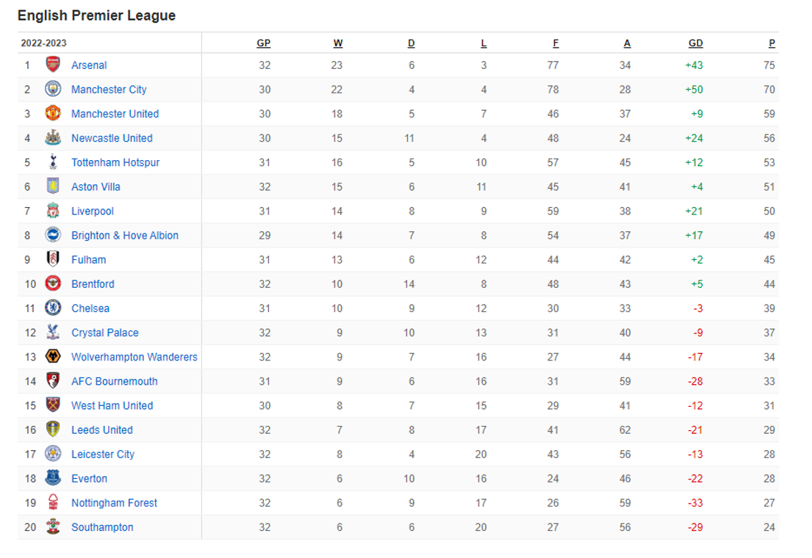
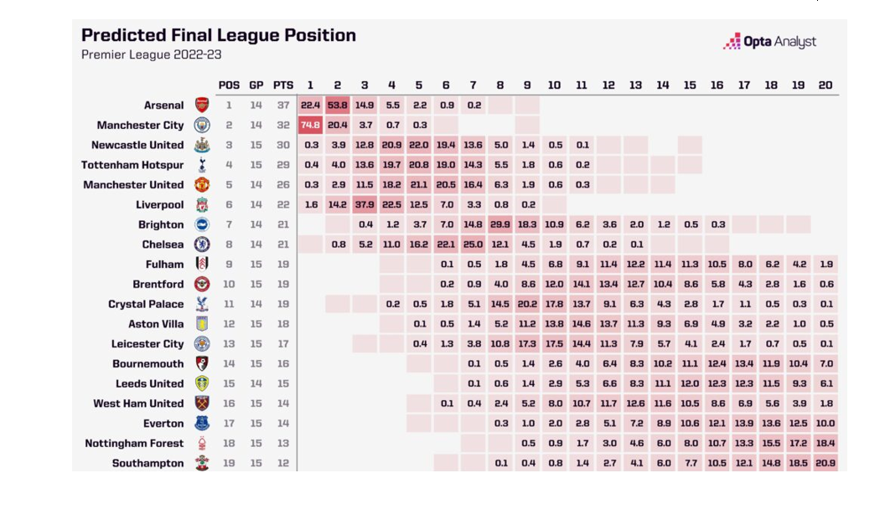
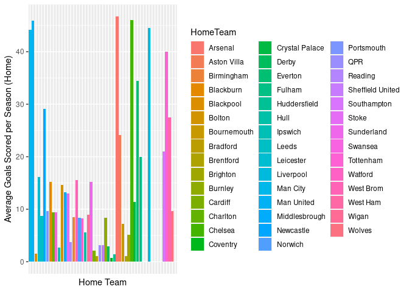
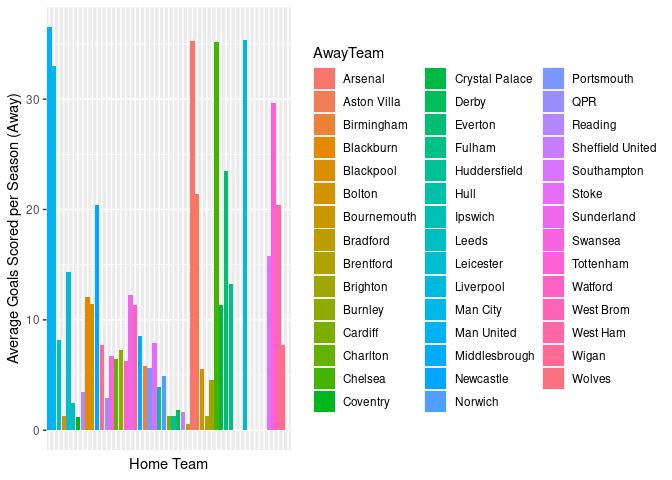
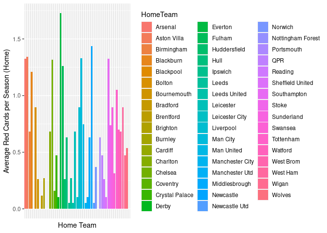
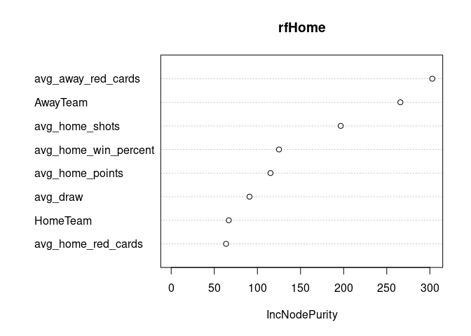
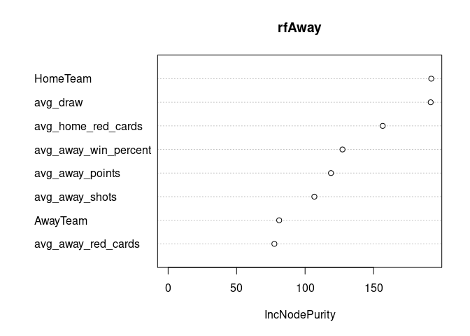

Final Project
================
2023-04-15

## Abstract

Sports betting is extremely commonplace in the world today - there are
thousands of algorithms and machine learning models that attempt to
predict sports betting. This paper extracts and analyzes data from the
European Premier League (EPL) to attempt to predict the scores and
thereby outcomes of the remaining games this season using a random
forest model. We were able to achieve an accuracy of nearly 40%,
however, due to the random nature of soccer and in order to avoid
overfitting, we were unable to achive a higher accuracy. There are
multiple ways this could be extended, such as modelling goals using a
poisson distribution, however, for the purposes of this paper we focus
on random forest modelling.

## Introduction

In recent years, the legalization of sports betting has become a hot
topic around the world, with an increasing number of countries embracing
this form of gambling. This shift in policy has led to a massive growth
in popularity for sports betting, as more and more people take advantage
of the opportunity to place bets on their favorite sports teams and
athletes. The legalization of sports betting has also had a significant
impact on the sports industry itself, with many leagues and teams
recognizing the potential for increased revenue and fan engagement. As a
result, we have seen a surge in partnerships between sports
organizations and betting companies, as well as the development of new
technologies and platforms to facilitate sports betting. The English
Premier League is potentially the most lucrative and exciting sports
league to bet on, with unexpected outcomes occurring every week. This
year is particularly special, with exciting opportunities for bettors to
maximize outcomes both at the top and bottom of the league. At the top
of the league, Arsenal holds a steady lead over Manchester City in an
unexpected turn of events after having fallen out of the Champions
League placings this time last year. Liverpool, a favorite to compete
for the title, see themselves hanging on to 8 th place after matchweek
29 while Chelsea continue to fall, sitting at 11th currently. In
addition to the surprise at the top, the bottom 9 teams are separated by
only 6 points. In other words, Southampton could theoretically jump from
last place to 12 th if all the teams ahead of them lose 2 games and they
win those 2 games. While this is unlikely, it shows that the EPL is as
unpredictable now as it was at the beginning of the season. Below we
show the current EPL table as we write this report, with some crucial
games that still need to be decided.

<!-- --> In addition to the current table, the figure
below represents all the different predicted finishes of all 20 teams in
the 2022/2023. This is used here as a visual example of the
unpredictability of the season and why there is so much room for bettors
to make more revenue. An unpredictable bet (Arsenal finishing in 1st
place) would be significantly more lucrative than a predictable one
(Manchester City not finishing in 20th place) so being able to “find a
signal in the noise” would be extremely useful to bettors.

<!-- -->

## Data

### Data Collection/Concatenation

The first step in creating our random forest model was collecting data -
this was not as simple as just going online and finding a csv. For
seasons 2000-2021, there was previously aggregated data readily
available, but for the 2022-2023 season, there was no data in a
read-to-use format. In order to counteract this, we had to scrape the
data from the websites ourselves. In order to accomplish this, we used
the site fbref.com. The official European Premier League site and
several other data sources had data-scraping prevention measures in
place. The fbref site has extremely detailed statistics for each macth
in the 2022 season. The scraping code (visible in the appendix), loops
through the match statistics for each game, and saves them in an
individual csv - it then combines each csv into one dataset. This
dataset contains 138 variables across over 3000 observations -
initially, the scraped data has an observation for each player in each
match. However, we combatted this by sorting the data by the team and
date, and then computing summary statistics for each team/date. This
gave us one observation for each team for each match. Then we combined
our intital dataset with the kaggle data that we had for seasons
2000-2021. This part of the process was done Excel for simplicities
sake.

In order to test this question, we used a random forest model to predict
the winner - there are threee posibble results.

1.  The Home Team wins
2.  The Away Team wins
3.  The two teams draw

In order to accurately produce this random forest model, we have to
manipulate some of the variables in the data. For example, the final
result of a match is going to be perfectly correlated with the number of
goals the home and away team score respectively. As such, we would
rather use some kind of average of past results to determine the
likelihood of each team winning. In order to do this, we took a moving
average of the scores of each team during their past 5 and past 10 home
games, and their past 5 and past 10 away games. This gives us an idea of
how well each team is performing at home versus how well they are
performing away, as well as their offensive pressure. Another measure of
pressure that we use is average shots on target for the same metrics
(home, away, past 5 games, past 10 games). Because our dataset includes
observations from 2000 to until 2023, it makes sense that the most
recent results should be more valuable than the results from 2000. As
such, we created a variable “Weight” that weights the most recent
observations more heavily in the data. Finally, it is important to
consider that for certian intangible reasons, some teams play better or
worse against other teams. As such, we created a new data frame that
took into account each team’s head-to-head record. From this dataset, we
included the win percentage of each team at home and each team away
against each other team. The rational behind including only red cards is
that a yellow card does not effect the overall scope of the game - no
one has to come off the field unless it is their second yellow which is
then counted as a red. The final dataset included Date, Weight, Home
shots on target averaged over the past 5 and 10 games, Away shots on
target averaged over the past 5 and 10 games, head to head win
percentage and draw percentage at home and away, and red cards per game
home and away for each team.

Of these variables, it only made sense to include only either the home
shots and goals and away shots and goals averaged over 5 years or 10
years. If we included both we would run into collinearity. When we ran
the random forest model, we created a variable importance plot for each
iteration. The variables averaged over the past 10 years proved to have
the greater importance for the overall model, and thus, these are the
variables that we kept.

### Data Description

As previously mentioned, our final dataset included several variables
that averaged shots on target, red cards, goals scored, and head-to-head
record over the past \~23 seasons. This data has over 8000 observations.
However, we also wanted to make sure that seasons further in the past
were not being considered with the same weight as recent seasons in the
model. As such, we created another new variable, weight, that utilized
an exponential decay function in order to make sure the results from the
current season were wighted heaviest and results from past seasons were
weighted less. Our final data included: Home Team, Away Team, Home
Goals, Away Goals, Home Shots on Target (averaged over 10 years), Away
Shots on Target (averaged over 10 years), Home Red Cards, Away Head
Cards, and Head-to-Head winning percentage at home and away, as well as
draw percentage.

## Data Visualization

<!-- --><!-- -->
These plots show the average goals each team scores in a season at home
or away. As we might expect, some of the more consistently higher-ranked
teams such as Arsenal or Manchester City have high averages both home
and away. Other teams that are less “heavy-hitters” such as Reading
score on average far fewer goals per season.

<!-- --> This
graph shows the average number of red cards each team receives at home
over the seasons. Everton has far and away the highest number of cards -
this was also evident when we summed the red cards each team has
received. Everton has received over 30 red cards, which was a fair bit
higher than any of the other teams.

## Methods (See Results for More Detail)

In order to predict the winner of each Premier League game for the
remainder of the season, we chose to run two separate models. The first
is a random forest predicting the home team goals home team, away team,
away team red cards, home team red cards, average goals scored, and
head-to head record to predict the goals a given home team would score
in a match. The second model was the same, but with the away team,
predicting away team goals. It therefore stands to reason that the team
with more goals wins the match. In order to ensure that we were not over
fitting these models, we used k-fold cross validation (5 folds), on a
dataset that did not include the remaining matches. We split this into a
training and testing dataset, and ran both models.

## Results

Initially, the accuracy that we found was near 0%. Logically, we
realized that this made sense - because we were using averages, the
numbers that the model was predicting for the number of goals each team
scored were decimals, not whole numbers. Because goals are only whole
numbers, the model was basically predicting nothing exactly correctly.
This lead us to the decision to round our predictions to the nearest
whole number. When we did this, our accuracy jumped to around 20% for
both models. However, this still is not overly accurate. By engineering
the tree-depths and number of trees in the model, we were able to get
the accuracy up to \~40% for both models. While this is still not
percect, past this point anything we changed started to err towards
model overfitting. In addition, this is predicting the number of goals
for each teams. While we were not able to check this, it stands to
reason that the winner may be slightly more accurately predicted than
just the number of goals (a game can be 3-1 or 2-1 and the same team
still wins). Some of the interesting things that this model showed were:

1.  Opposing team red cards were one of the most important variables in
    the models. This could be because having a man up is a hige
    advantage. However, this result also could be skewed because there
    are not too many games where red cards are given out, and red cards
    could be confounded by frustration at losing.

2.  The opponent is also an extremely important predictor - this
    contributes to theory that some times simply play better or worse
    against specific opponents.

The variable importance plots for each model are shown here:

<!-- --><!-- -->

The variable importance plots show the relative importance of each
variable in the model - the variables closest to the top of the plot are
the most important.

Finally, we used the models we have trained and tested to predict the
remaining games this season. The table of predictions is shown below:

| Home Team         | Away Team         | Home Prediction | Away Prediction |
|:------------------|:------------------|----------------:|----------------:|
| Fulham            | Leeds United      |               2 |               1 |
| Crystal Palace    | Everton           |               1 |               1 |
| Brentford         | Aston Villa       |               1 |               2 |
| Liverpool         | Nottingham Forest |               3 |               1 |
| Leicester City    | Wolves            |               2 |               1 |
| Manchester Utd    | Chelsea           |               2 |               1 |
| Bournemouth       | West Ham          |               1 |               2 |
| Newcastle Utd     | Tottenham         |               1 |               1 |
| Brighton          | Manchester City   |               1 |               1 |
| Wolves            | Crystal Palace    |               1 |               1 |
| Aston Villa       | Fulham            |               1 |               1 |
| Leeds United      | Leicester City    |               2 |               2 |
| Nottingham Forest | Brighton          |               2 |               2 |
| Chelsea           | Brentford         |               3 |               1 |
| West Ham          | Liverpool         |               1 |               2 |
| Manchester City   | Arsenal           |               2 |               2 |
| Everton           | Newcastle Utd     |               1 |               1 |
| Southampton       | Bournemouth       |               1 |               1 |
| Tottenham         | Manchester Utd    |               2 |               1 |
| Crystal Palace    | West Ham          |               1 |               2 |
| Brighton          | Wolves            |               1 |               1 |
| Brentford         | Nottingham Forest |               2 |               1 |
| Manchester Utd    | Aston Villa       |               2 |               2 |
| Bournemouth       | Leeds United      |               2 |               1 |
| Newcastle Utd     | Southampton       |               2 |               1 |
| Fulham            | Manchester City   |               2 |               1 |
| Liverpool         | Tottenham         |               2 |               1 |
| Leicester City    | Everton           |               1 |               1 |
| Arsenal           | Chelsea           |               2 |               1 |
| Liverpool         | Fulham            |               2 |               1 |
| Manchester City   | West Ham          |               2 |               1 |
| Brighton          | Manchester Utd    |               1 |               2 |
| Tottenham         | Crystal Palace    |               2 |               1 |
| Wolves            | Aston Villa       |               1 |               2 |
| Bournemouth       | Chelsea           |               1 |               1 |
| Liverpool         | Brentford         |               3 |               1 |
| Manchester City   | Leeds United      |               2 |               1 |
| Newcastle Utd     | Arsenal           |               2 |               2 |
| West Ham          | Manchester Utd    |               2 |               1 |
| Fulham            | Leicester City    |               2 |               1 |
| Brighton          | Everton           |               1 |               1 |
| Nottingham Forest | Southampton       |               1 |               1 |
| Leeds United      | Newcastle Utd     |               2 |               2 |
| Aston Villa       | Tottenham         |               1 |               1 |
| Chelsea           | Nottingham Forest |               3 |               1 |
| Brentford         | West Ham          |               1 |               2 |
| Crystal Palace    | Bournemouth       |               2 |               1 |
| Southampton       | Fulham            |               1 |               1 |
| Manchester Utd    | Wolves            |               2 |               1 |
| Everton           | Manchester City   |               1 |               1 |
| Arsenal           | Brighton          |               2 |               2 |
| Leicester City    | Liverpool         |               1 |               2 |
| Brighton          | Southampton       |               1 |               1 |
| West Ham          | Leeds United      |               2 |               1 |
| Tottenham         | Brentford         |               2 |               1 |
| Manchester City   | Chelsea           |               2 |               1 |
| Liverpool         | Aston Villa       |               2 |               1 |
| Newcastle Utd     | Leicester City    |               2 |               1 |
| Fulham            | Crystal Palace    |               2 |               1 |
| Nottingham Forest | Arsenal           |               1 |               1 |
| Bournemouth       | Manchester Utd    |               2 |               2 |
| Wolves            | Everton           |               1 |               1 |
| Crystal Palace    | Nottingham Forest |               2 |               1 |
| Chelsea           | Newcastle Utd     |               3 |               1 |
| Manchester Utd    | Fulham            |               2 |               1 |
| Arsenal           | Wolves            |               2 |               1 |
| Southampton       | Liverpool         |               1 |               2 |
| Everton           | Bournemouth       |               1 |               1 |
| Leicester City    | West Ham          |               1 |               1 |
| Aston Villa       | Brighton          |               1 |               2 |
| Leeds United      | Tottenham         |               1 |               1 |
| Brentford         | Manchester City   |               2 |               1 |

## Conclusions/Extensions

While our model seems reasonable, it could certainly be improved.
Perhaps one inherent issue with using a random forest model to predict
something like goals is that under random forest, it is assumed all
parameters are normally distributed. However, there is research to
suggest that goals follow a Poisson distribution, not a normal
distribution. It may be interesting to investigate using poisson
distributed goals as a predictor. If given time, we would also enjoy
looking at the effect previous wins have on success - i.e. do teams
really go on runs? Do losing streaks compound?

There are so many different variables that you could use to predict EPL
success. However, it is extremely easy to start overfitting these
models. The truth is soccer, or football, is random. Someone has a good
day, someone has a bad day. This nature of the sport makes it very hard
to predict accurately. Our model predicts scores with a reasonable
amount of accuracy, but it is still not nearly precise enough to
guarantee a winning bet every time

## Sources

1.  Doan, T. N. (2020, November 4). The beautiful game: Predicting the
    Premier League with a random model. Medium. Retrieved April 23,
    2023, from
    <https://towardsdatascience.com/o-jogo-bonito-predicting-the-premier-league-with-a-random-model-1b02fa3a7e5a>

2.  K, B. (2022, July 31). Soccer analytics tutorial: Scraping EPL data
    using R (2022 update). Sweep Sports Analytics. Retrieved April 23,
    2023, from
    <https://sweepsportsanalytics.com/2022/07/31/soccer-analytics-tutorial-scraping-epl-data-using-r-2022-update/?utm_source=rss&utm_medium=rss&utm_campaign=soccer-analytics-tutorial-scraping-epl-data-using-r-2022-update>

3.  Nguyen, Q. (2021, December 3). Poisson modeling and predicting
    English premier league goal scoring: The New England Journal of
    Statistics in data science: New england statistical society. The New
    England Journal of Statistics in Data Science. Retrieved April 23,
    2023, from <https://nejsds.nestat.org/journal/NEJSDS/article/1/text>

4.  Utikal, N. (2020, July 17). Predict football results with random
    forest. Medium. Retrieved April 23, 2023, from
    <https://medium.com/@nicholasutikal/predict-football-results-with-random-forest-c3e6f6e2ee58>

## Appendix

The code chunks that we used are clearly labelled in the appendix -
however, we included the errant code chunks as well so that the process
was visible.

``` r
knitr::opts_chunk$set(echo = TRUE)

library(readr)
library(reshape2)
library(lubridate)

library(plyr)
library(dplyr)
library(data.table)
require(corrplot, quietly=TRUE)

require(ggplot2, quietly=TRUE)

library(caret)
library(rpart)

library(randomForest)


## initial dataset
epl = read_csv("results.csv")
head(epl)
epl$FTR <- as.factor(epl$FTR)
epl$HomeTeam <- as.factor(epl$HomeTeam)
epl$AwayTeam <- as.factor(epl$AwayTeam)

##Initial Scraping Attempt - DISREGARD - this did not work correctly 
library(rvest)
library(stringr)

# Read the website and parse the HTML content
url <- "https://fbref.com/en/comps/9/Premier-League-Stats#all_stats_squads_gca"
page <- read_html(url)

# Extract the team names
team_names <- page %>% html_nodes(".left:nth-child(2) a") %>% html_text()

# Extract the shots on target data
data_rows <- page %>% html_nodes("table.stats_table tbody tr")
shots_on_target <- lapply(data_rows, function(row) {
  row_cells <- row %>% html_nodes("td")
  home_shots <- as.numeric(str_replace_all(row_cells[6] %>% html_text(), "\\D", ""))
  away_shots <- as.numeric(str_replace_all(row_cells[9] %>% html_text(), "\\D", ""))
  c(home_shots, away_shots)
})

# Combine the team names and shots on target data into a data frame
shots_on_target_df <- data.frame(
  Team = team_names,
  HomeShotsOnTarget = sapply(shots_on_target, `[`, 1),
  AwayShotsOnTarget = sapply(shots_on_target, `[`, 2)
)

# Print the resulting data frame
print(shots_on_target_df)


##Initial Scraping Attempt - DISREGARD - this did not work correctly 
url <- "https://fbref.com/en/comps/9/3230/2022-2023-Premier-League-Stats#all_stats_squads_gca"
page <- read_html(url)

# Extract the team names
team_names <- page %>% html_nodes(".left:nth-child(2) a") %>% html_text()

# Extract the shots on target data
data_rows <- page %>% html_nodes("table.stats_table tbody tr")
shots_on_target <- lapply(data_rows, function(row) {
  row_cells <- row %>% html_nodes("td")
  home_shots <- as.numeric(str_replace_all(row_cells[6] %>% html_text(), "\\D", ""))
  away_shots <- as.numeric(str_replace_all(row_cells[9] %>% html_text(), "\\D", ""))
  c(home_shots, away_shots)
})

# Combine the team names and shots on target data into a data frame
shots_on_target_df2022 <- data.frame(
  Team = team_names,
  HomeShotsOnTarget = sapply(shots_on_target, `[`, 1),
  AwayShotsOnTarget = sapply(shots_on_target, `[`, 2)
)

# Print the resulting data frame
print(shots_on_target_df2022)


##Initial Scraping Attempt - DISREGARD - this did not work correctly 
url <- "https://fbref.com/en/comps/9/3230/2022-2023-Premier-League-Stats#all_stats_squads_gca"
page <- read_html(url)

# Extract the team names
team_names <- page %>% html_nodes(".left:nth-child(2) a") %>% html_text()

# Extract the shots on target data
data_rows <- page %>% html_nodes("table.stats_table tbody tr")
shots_on_target <- lapply(data_rows, function(row) {
  row_cells <- row %>% html_nodes("td")
  date <- row_cells[2] %>% html_text() %>% str_trim()
  home_shots <- as.numeric(str_replace_all(row_cells[6] %>% html_text(), "\\D", ""))
  away_shots <- as.numeric(str_replace_all(row_cells[9] %>% html_text(), "\\D", ""))
  c(date, home_shots, away_shots)
})

# Combine the team names, shots on target data, and match dates into a data frame
shots_on_target_df2022 <- data.frame(
  Date = sapply(shots_on_target, `[`, 1),
  Team = team_names,
  HomeShotsOnTarget = sapply(shots_on_target, `[`, 2),
  AwayShotsOnTarget = sapply(shots_on_target, `[`, 3)
)


##Data Scraping Working Version
url <- read_html("https://fbref.com/en/comps/9/schedule/Premier-League-Scores-and-Fixtures")
page <- url
links_1 <- unlist(page %>% html_nodes("a") %>% html_attr('href'))
head(links_1)

links_2 <- strsplit(links_1, '"')
links_3 <- links_2[grepl("matches", links_2)]
links_4 <- links_3[grepl("Premier", links_3)]
all_urls <- unique(links_4)

team_urls <- all_urls

# Create the actual links by pasting the domain and the rest of the URL, picked up from our previous scraping effort
selected_urls <- paste("https://fbref.com", team_urls, sep="")

# Modify URLs for dates in first 9 days of the month
selected_urls <- str_replace(selected_urls, "-1-", "-01-")
selected_urls <- str_replace(selected_urls, "-2-", "-02-")
selected_urls <- str_replace(selected_urls, "-3-", "-03-")
selected_urls <- str_replace(selected_urls, "-4-", "-04-")
selected_urls <- str_replace(selected_urls, "-5-", "-05-")
selected_urls <- str_replace(selected_urls, "-6-", "-06-")
selected_urls <- str_replace(selected_urls, "-7-", "-07-")
selected_urls <- str_replace(selected_urls, "-8-", "-08-")
selected_urls <- str_replace(selected_urls, "-9-", "-09-")

#initialize tables
all_stat <- NULL
full_stat <- NULL

for (g in 1:length(selected_urls)){
  # Get the game info from the URL
  game_data <- substr(selected_urls[g], 39, nchar(selected_urls[g])-15)
  game_data <- str_replace(game_data, "January", "Jan")
  game_data <- str_replace(game_data, "February", "Feb")
  game_data <- str_replace(game_data, "March", "Mar")
  game_data <- str_replace(game_data, "April", "Apr")
  game_data <- str_replace(game_data, "June", "Jun")
  game_data <- str_replace(game_data, "July", "Jul")
  game_data <- str_replace(game_data, "August", "Aug")
  game_data <- str_replace(game_data, "September", "Sep")
  game_data <- str_replace(game_data, "October", "Oct")
  game_data <- str_replace(game_data, "November", "Nov")
  game_data <- str_replace(game_data, "December", "Dec")
  
  game_data <- str_replace(game_data, "North-West-London-Derby-", "")
  game_data <- str_replace(game_data, "Merseyside-Derby-", "")
  game_data <- str_replace(game_data, "North-London-Derby-", "")
  game_data <- str_replace(game_data, "Manchester-Derby-", "")
  game_data <- str_replace(game_data, "North-London-Derby-", "")
  
  date <- substr(game_data, nchar(game_data)-10, nchar(game_data))
  teams <- substr(game_data, 1, nchar(game_data)-12)
  teams <- str_replace(teams, "Manchester-United", "Manchester Utd")
  teams <- str_replace(teams, "Manchester-City", "Manchester City")
  teams <- str_replace(teams, "Leeds-United", "Leeds United")
  teams <- str_replace(teams, "Crystal-Palace", "Crystal Palace")
  teams <- str_replace(teams, "Leicester-City", "Leicester City")
  teams <- str_replace(teams, "Aston-Villa", "Aston Villa")
  teams <- str_replace(teams, "Norwich-City", "Norwich City")
  teams <- str_replace(teams, "Newcastle-United", "Newcastle Utd")
  teams <- str_replace(teams, "Wolverhampton-Wanderers", "Wolves")
  teams <- str_replace(teams, "West-Ham-United", "West Ham")
  teams <- str_replace(teams, "Brighton-and-Hove-Albion", "Brighton")
  teams <- str_replace(teams, "Tottenham-Hotspur", "Tottenham")
  
  teamA <- sub("-.*", "", teams)
  teamB <- sub(".*-", "", teams)
  
  #read the first pair of tables
  url <- selected_urls[g]
 
  
  statA <- curl::curl(url) %>% 
    xml2::read_html() %>%
    rvest::html_nodes('table') %>%
    rvest::html_table() %>%
    .[[4]]
  colnames(statA) <- paste0(colnames(statA), " >> ", statA[1, ])
  names(statA)[1:5] <- paste0(statA[1,1:5])
  statA <- statA[-c(1),]
  statA <- cbind(date, Team=teamA, Opponent=teamB, statA)
  statB <- curl::curl(url)  %>% 
    xml2::read_html() %>%
    rvest::html_nodes('table') %>%
    rvest::html_table() %>%
    .[[11]]
  colnames(statB) <- paste0(colnames(statB), " >> ", statB[1, ])
  names(statB)[1:5] <- paste0(statB[1,1:5])
  statB <- statB[-c(1),]
  statB <- cbind(date, Team=teamB, Opponent=teamA, statB)
  stat_both <- rbind(statA, statB)
  #define the game's data frame
  all_stat <- stat_both
  Sys.sleep(15)
  
  #loop for all tables related to the game
  for(i in 5:10){
    statA <- curl::curl(url) %>% 
      xml2::read_html() %>%
      rvest::html_nodes('table') %>%
      rvest::html_table() %>%
      .[[i]]
    colnames(statA) <- paste0(colnames(statA), " >> ", statA[1, ])
    names(statA)[1:5] <- paste0(statA[1,1:5])
    statA <- statA[-c(1),]
    statA <- cbind(date, Team=teamA, Opponent=teamB, statA)
    statB <- curl::curl(url)  %>% 
      xml2::read_html() %>%
      rvest::html_nodes('table') %>%
      rvest::html_table() %>%
      .[[i+7]]
    colnames(statB) <- paste0(colnames(statB), " >> ", statB[1, ])
    names(statB)[1:5] <- paste0(statB[1,1:5])
    statB <- statB[-c(1),]
    statB <- cbind(date, Team=teamB, Opponent=teamA, statB)
    stat_both <- rbind(statA, statB)
    all_stat <- merge(all_stat, stat_both, all=T)
    
    
    #remove any leading or trailing whitespaces
    all_stat$Player <- str_trim(all_stat$Player, side = c("both", "left", "right"))
    
    #convert all stats into numeric variables
    all_stat <- cbind(all_stat[,1:8], mutate_all(all_stat[,9:ncol(all_stat)], function(x) as.numeric(as.character(x))))
    

    
    write.csv(all_stat,paste0("premier_league_2022-23",game_data,".csv"))
    
    Sys.sleep(15)
  }
  #add the game tables to the total data frame
  full_stat <- rbind(full_stat, all_stat)
}


## Modifying Scraped Data 
write_csv(full_stat, "2022-23initial.csv")


full_stat$Goals = full_stat$`Performance >> Gls`
full_stat$SoTA = full_stat$`Performance >> SoT`


##Home Team Stats
sum_full_stat_home = full_stat %>% 
  group_by(Team, date) %>%
  mutate(HST = sum(SoTA, na.rm = TRUE)) %>%
  mutate(FTHG = sum(Goals, na.rm = TRUE)) %>%
  dplyr::select(Team, date, HST) 
sum_full_stat_home

##Away Team Stats 
sum_full_stat_away = full_stat %>%
   group_by(Opponent, date) %>%
  mutate(HST = sum(SoTA, na.rm = TRUE)) %>%
  mutate(FTHG = sum(Goals, na.rm = TRUE)) %>%
  dplyr::select(Team, date, HST) 
  

## Data manipulation v1 = this does not inlude the 2022-2023 data 
# Load the necessary packages
library(dplyr)
library(tidyr)

offensive_form_home <- epl %>%
  arrange(DateTime)%>%
  group_by(HomeTeam) %>%
  mutate(home_shots_last_5 = cumsum(HST)/5 - cumsum(lag(HST, default = 0))/5) %>%
  mutate(home_shots_last_10 = cumsum(HST)/10 - cumsum(lag(HST, default = 0))/10) %>%
  dplyr:: select(HomeTeam, Season,##AwayTeam,
                 DateTime, home_shots_last_5, home_shots_last_10)

offensive_form_away <- epl %>%
  arrange(DateTime)%>%
  group_by(AwayTeam) %>%
  mutate(away_shots_last_5 = cumsum(HST)/5 - cumsum(lag(AST, default = 0))/5) %>%
  mutate(away_shots_last_10 = cumsum(HST)/10 - cumsum(lag(AST, default = 0))/10) %>%
  dplyr::select(##HomeTeam, 
    AwayTeam, Season,DateTime, away_shots_last_5, away_shots_last_10)

test_home_points <- epl %>%
  arrange(DateTime) %>%
  group_by(HomeTeam) %>%
  mutate(home_shots_last_5 = cumsum(HST) / cumsum(!is.na(HST)) %/% 5) %>%
  mutate(home_shots_last_10 = cumsum(HST) / cumsum(!is.na(HST)) %/% 10) %>%
 dplyr:: select(HomeTeam, Season,DateTime, home_shots_last_5, home_shots_last_10)
  

  
# Create a variable for home team form
home_form <- epl %>%
  arrange(DateTime) %>%
  group_by(HomeTeam)%>%
  mutate(home_points_last_5 = cumsum(FTHG)/5 - cumsum(lag(FTHG, default = 0))/5) %>%
  mutate(home_points_last_10 = cumsum(FTHG)/10 - cumsum(lag(FTHG, default = 0))/10)%>%
  dplyr::select(HomeTeam, ##AwayTeam, 
                DateTime, Season,home_points_last_5, home_points_last_10)


# Create a variable for away team form
away_form <- epl %>%
  arrange(DateTime) %>%
  group_by(AwayTeam) %>%
  mutate(away_points_last_5 = cumsum(FTAG)/5 - cumsum(lag(FTAG, default = 0))/5) %>%
  mutate(away_points_last_10 = cumsum(FTAG)/10 - cumsum(lag(FTAG, default = 0))/10)%>%
  dplyr::select(##HomeTeam,
    AwayTeam, DateTime,Season, away_points_last_5, away_points_last_10)

# Create a variable for head-to-head record
head_to_head <- epl %>%
  group_by(HomeTeam, AwayTeam) %>%
  summarize(home_wins = sum(FTHG > FTAG),
            away_wins = sum(FTAG > FTHG),
            draws = sum(FTHG == FTAG)) %>%
  mutate(home_win_percentage = home_wins / (home_wins + away_wins + draws),
         away_win_percentage = away_wins / (home_wins + away_wins + draws),
         draw_percentage = draws / (home_wins + away_wins + draws)) 
##%>%
  ##select(home_team, away_team, home_win_percentage, away_win_percentage, draw_percentage)

# Create a variable for team injuries and suspensions
suspensionsHome <- epl %>%
  group_by(HomeTeam) %>%
  summarize(total_red_cards_home = sum(HR)) 
suspensionsAway <- epl %>% group_by(AwayTeam) %>%
               summarize(total_red_cards_away = sum(AR))
##%>%
  ##select(home_team, away_team, total_red_cards)

# Combine all the variables into a single dataset

names(epl)
names(away_form)
model_epl <- epl %>%
  dplyr::select(HomeTeam, AwayTeam, FTHG, FTAG, FTR, HST, AST, DateTime, Season) %>%
  left_join(home_form, by = c("HomeTeam", "DateTime"))%>%
   dplyr::select(-AwayTeam, everything()) 

names(model_epl)[names(model_epl) == "AwayTeam.y"] <- "AwayTeam"

model_epl = model_epl %>%
  left_join(away_form, by = c("AwayTeam", "DateTime")) %>%
  left_join(offensive_form_away, by = c("AwayTeam", "DateTime"))%>%
  left_join(offensive_form_home, by = c("HomeTeam", "DateTime")) %>% 
  left_join(head_to_head) %>%
  left_join(suspensionsHome) %>%
  left_join(suspensionsAway)


  


## Data manipulation - this is the initial data manipulation that we used through the majority of the project - the differene between this and the above chunk is that this inludes the 2022-2023 data
# Load the necessary packages

library(zoo)
library(dplyr)
library(tidyr)

epl_final = read_csv("results_final.csv")
##epl_final = epl_final[-c(1:5702),]
epl_final$FTR <- as.factor(epl_final$FTR)
epl_final$HomeTeam <- as.factor(epl_final$HomeTeam)
epl_final$AwayTeam <- as.factor(epl_final$AwayTeam)
##epl_final <- epl_final %>%
 ## mutate(year = substr(Season, 1, 4), # extract the year from the season
  ##       weight = exp(-0.1 * (as.numeric(year) - 2000)))


offensive_form_home_final <- epl_final %>%
  arrange(DateTime)%>%
  group_by(HomeTeam) %>%
  mutate(home_shots_last_5 = cumsum(HST)/5 - cumsum(lag(HST, default = 0))/5) %>%
  mutate(home_shots_last_10 = cumsum(HST)/10 - cumsum(lag(HST, default = 0))/10) %>%
  dplyr:: select(HomeTeam, Season,##AwayTeam,
                 DateTime, home_shots_last_5, home_shots_last_10)
offensive_form_home_final <- offensive_form_home_final %>%
  distinct(HomeTeam, DateTime, .keep_all = TRUE)

offensive_form_away_final <- epl_final %>%
  arrange(DateTime)%>%
  group_by(AwayTeam) %>%
  mutate(away_shots_last_5 = cumsum(HST)/5 - cumsum(lag(AST, default = 0))/5) %>%
  mutate(away_shots_last_10 = cumsum(HST)/10 - cumsum(lag(AST, default = 0))/10) %>%
  dplyr::select(##HomeTeam, 
    AwayTeam, Season,DateTime, away_shots_last_5, away_shots_last_10)

offensive_form_away_final <- offensive_form_away_final %>%
  distinct(AwayTeam, DateTime, .keep_all = TRUE)


  
# Create a variable for home team form
home_form_final <- epl_final %>%
  arrange(DateTime) %>%
  group_by(HomeTeam)%>%
  mutate(home_points_last_5 = cumsum(FTHG)/5 - cumsum(lag(FTHG, default = 0))/5) %>%
  mutate(home_points_last_10 = cumsum(FTHG)/10 - cumsum(lag(FTHG, default = 0))/10)%>%
  dplyr::select(HomeTeam, ##AwayTeam, 
                DateTime, Season,home_points_last_5, home_points_last_10)
home_form_final <- home_form_final %>%
  distinct(HomeTeam, DateTime, .keep_all = TRUE)


# Create a variable for away team form
away_form_final <- epl_final %>%
  arrange(DateTime) %>%
  group_by(AwayTeam) %>%
  mutate(away_points_last_5 = cumsum(FTAG)/5 - cumsum(lag(FTAG, default = 0))/5) %>%
  mutate(away_points_last_10 = cumsum(FTAG)/10 - cumsum(lag(FTAG, default = 0))/10)%>%
  dplyr::select(##HomeTeam,
    AwayTeam, DateTime,Season, away_points_last_5, away_points_last_10)
away_form_final <- away_form_final %>%
  distinct(AwayTeam, DateTime, .keep_all = TRUE)

# Create a variable for head-to-head record
head_to_head_final <- epl_final %>%
  group_by(HomeTeam, AwayTeam) %>%
  summarize(home_wins = sum(FTHG > FTAG),
            away_wins = sum(FTAG > FTHG),
            draws = sum(FTHG == FTAG)) %>%
  mutate(home_win_percentage = home_wins / (home_wins + away_wins + draws),
         away_win_percentage = away_wins / (home_wins + away_wins + draws),
         draw_percentage = draws / (home_wins + away_wins + draws))
        

# Create a variable for team injuries and suspensions
suspensionsHomefinal <- epl_final %>%
  group_by(HomeTeam) %>%
  summarize(total_red_cards_home = sum(HR)) 
suspensionsAwayfinal <- epl_final %>% group_by(AwayTeam) %>%
               summarize(total_red_cards_away = sum(AR))
##%>%
  ##select(home_team, away_team, total_red_cards)

# Combine all the variables into a single dataset

names(epl_final)
names(away_form_final)
model_epl_final <- epl_final %>%
  dplyr::select(HomeTeam, AwayTeam, FTHG, FTAG, FTR, HST, AST, DateTime, Season) %>%
  left_join(home_form_final, by = c("HomeTeam", "DateTime"))
##%>%
   ##dplyr::select(-AwayTeam, everything())

model_epl_final

names(model_epl_final)[names(model_epl_final) == "AwayTeam.y"] <- "AwayTeam"

model_epl_final = model_epl_final %>%
  left_join(away_form_final, by = c("AwayTeam", "DateTime"))
model_epl_final = model_epl_final %>%
  left_join(offensive_form_away_final, by = c("AwayTeam", "DateTime"))%>%
  left_join(offensive_form_home_final, by = c("HomeTeam", "DateTime")) %>% 
  left_join(head_to_head_final) %>%
  left_join(suspensionsHomefinal) %>%
  left_join(suspensionsAwayfinal)
model_epl_final

model_epl_final <- model_epl_final %>% slice(1:8669)
model_epl_final

write_csv(model_epl_final, "final_data2.csv")


HT = epl_final %>% 
  group_by(HomeTeam, Season) %>%
  summarize(SumGoals = sum(FTHG), AvgGoals = mean(FTHG))

p1 = ggplot(HT, aes(x = reorder(HomeTeam, -AvgGoals), y = AvgGoals, fill = HomeTeam)) + geom_bar(stat = "identity") + ylab("Average Goals Scored per Season (Home)") + xlab("Home Team") + theme(
        axis.text.x=element_blank(),
        axis.ticks.x=element_blank())  
p1


AT = epl_final %>% 
  group_by(AwayTeam, Season) %>%
  summarize(SumGoals = sum(FTAG), AvgGoals = mean(FTAG))

p2 = ggplot(AT, aes(x = reorder(AwayTeam, -AvgGoals), y = AvgGoals, fill = AwayTeam)) + geom_bar(stat = "identity") + ylab("Average Goals Scored per Season (Away)") + xlab("Home Team") + theme(
        axis.text.x=element_blank(),
        axis.ticks.x=element_blank()) 
p2

HR_data = epl_final %>% 
  group_by(HomeTeam, Season) %>%
  summarize(SumCards = sum(HR), AvgCards = mean(HR))

p3 = ggplot(HR_data, aes(x = HomeTeam, y =AvgCards, fill = HomeTeam)) + geom_bar(stat = "identity") + ylab("Average Red Cards per Season (Home)") + xlab("Home Team") + theme(
        axis.text.x=element_blank(),
        axis.ticks.x=element_blank())  
p3


## Initial Model - this did not get used because we need cross-fold validation - DISREGARD
##train/test split
set.seed(123)

model_epl$Weight <- as.numeric(Sys.Date() - as.Date(model_epl$DateTime))
train_idx <- sample(nrow(model_epl), 0.8 * nrow(model_epl))
train_data <- model_epl[train_idx, ]
test_data <- model_epl[-train_idx, ]

## initial model - not enough validation - DISREGARD
train_data

model_epl

rf_model <- randomForest(FTR ~ HomeTeam.x + AwayTeam.y + home_points_last_5 + home_points_last_10 + away_points_last_5 + away_points_last_10 + away_shots_last_5 + away_shots_last_10 + home_shots_last_5 + home_shots_last_10, data = train_data, weights = train_data$weight, ntree = 4)
summary(rf_model)


predictions <- predict(rf_model, newdata =test_data)
predictions

confusion_matrix <- table(predictions, test_data$FTR)
accuracy <- sum(diag(confusion_matrix)) / sum(confusion_matrix)
print(confusion_matrix)
print(paste0("Accuracy: ", round(accuracy, 2)))

epl_current = read_csv("current_epl.csv")

epl_current = epl_current.rename("Home Team":"HomeTeam")


 


##DISREGARD = ANOTHER INITIAL ATTEMPT
teams23 = read_csv("Teams23.csv")
teams23$HomeTeam = teams23$`Home Team` 
teams23$AwayTeam = teams23$`Away Team`
t


##Training and Testing on data not including this season
##home_points_last_5 + home_points_last_10 + away_points_last_5 + away_points_last_10 + away_shots_last_5 + away_shots_last_10 + home_shots_last_5 + home_shots_last_10, weights = train_data$Weight

model_epl$Season = as.numeric(model_epl$Season)
model_epl <- model_epl %>%
  mutate(weight = exp(-(Season - max(Season))/2))
library(caret)
library(randomForest)


set.seed(123) # for reproducibility

# Add the Weight column

# Define the number of folds
k <- 5

# Create the folds
folds <- createFolds(model_epl$weight, k = k)

# Initialize a vector to store evaluation results
results <- numeric(k)
results_train <- numeric(k)

# Loop through the folds
for (i in 1:k) {
  # Get the indices for the current fold
  test_idx <- folds[[i]]
  
  # Subset the data for the current fold
  test_data <- teams23
  ##test_data <- model_epl[test_idx, ]
  train_data <- model_epl[-test_idx, ]


  # Fit the model on the training data
rf_model <- randomForest(FTR ~ HomeTeam + AwayTeam + home_points_last_10 + away_points_last_10 + away_shots_last_10 + home_shots_last_10 + home_win_percentage + away_win_percentage + draw_percentage + total_red_cards_home +total_red_cards_away , weights = train_data$weight,
data = train_data, ntree = 4)
  preds_train = predict(rf_model, newdata = train_data)
  # Make predictions on the test data
  preds <- predict(rf_model, newdata = test_data)
  
  # Calculate accuracy
 confusion_matrix <- table(preds, test_data$FTR)
accuracy <- sum(diag(confusion_matrix)) / sum(confusion_matrix)

confusion_matrix_train <- table(preds_train, train_data$FTR)
accuracy_train <- sum(diag(confusion_matrix_train)) / sum(confusion_matrix_train)
  
  
  # Store the result for the current fold
  results[i] <- accuracy
  results_train[i] <- accuracy_train
}


results_train
results
accuracy
accuracy_train

##Initial Attempt - DISREGARD

varImpPlot(rf_model, main = "Variable Importance of the Random Forest Model")
p <- plot(results_train, type = "b", col = "blue")
# Add the second line
lines(results, type = "b", col = "red")
# Add a title to the plot
title(main = "Training and Test Results")
# Add a title to the x-axis
title(xlab = "Epochs")
# Add a title to the y-axis
title(ylab = "Loss")
# Add a legend
legend("topright", 
       legend = c("Training", "Test"), 
       col = c("blue", "red"), 
       lty = 1, 
       cex = 0.8)

bcrf <- rf_viz(rf_model, input=TRUE, imp=TRUE, cmd=TRUE)


##THIS CODE WORKS, BUT DOES NOT OUTPUT THE DATA WE NEED -DISREGARD
##Training and Testing on data including this season
##home_points_last_5 + home_points_last_10 + away_points_last_5 + away_points_last_10 + away_shots_last_5 + away_shots_last_10 + home_shots_last_5 + home_shots_last_10, weights = train_data$Weight

mydata = read_csv("final_data2.csv")

mydata <-mydata %>%
 mutate(year = substr(Season, 1, 4), # extract the year from the season
    weight = exp(-0.1 * (as.numeric(year) - 2000)))

mydatatrain = mydata %>%
  na.omit(my_data) %>%
  slice(1:8597)

  library(caret)
library(randomForest)


set.seed(123) # for reproducibility

# Add the Weight column

# Define the number of folds
k <- 5

# Create the folds
folds <- createFolds(mydatatrain$weight, k = k)

# Initialize a vector to store evaluation results
results <- numeric(k)
results_train <- numeric(k)

# Loop through the folds
for (i in 1:k) {
  # Get the indices for the current fold
  test_idx <- folds[[i]]
  
  # Subset the data for the current fold
  
  test_data <- mydatatrain[test_idx, ]
  train_data <- mydatatrain[-test_idx, ]


  # Fit the model on the training data
rf_model <- randomForest(FTR ~ HomeTeam + AwayTeam + home_points_last_10 + away_points_last_10 + away_shots_last_10 + home_shots_last_10 + home_win_percentage + away_win_percentage + draw_percentage + total_red_cards_home +total_red_cards_away , weights = train_data$weight,
data = train_data, ntree = 4)
  preds_train = predict(rf_model, newdata = train_data)
  # Make predictions on the test data
  preds <- predict(rf_model, newdata = test_data)
  
  # Calculate accuracy
 confusion_matrix <- table(preds, test_data$FTR)
accuracy <- sum(diag(confusion_matrix)) / sum(confusion_matrix)

confusion_matrix_train <- table(preds_train, train_data$FTR)
accuracy_train <- sum(diag(confusion_matrix_train)) / sum(confusion_matrix_train)
  
  
  # Store the result for the current fold
  results[i] <- accuracy
  results_train[i] <- accuracy_train
}


results_train
results
accuracy
accuracy_train

##Disregard this chunk - THIS CODE DOES NOT WORK
# Load data
mydata2 <- read_csv("final_data2.csv")
mydata$FTR = as.character(mydata$FTR)
mydata <- na.omit(mydata[c("HomeTeam", "AwayTeam", "Season", "FTR", "home_points_last_10", "away_points_last_10", "home_shots_last_10", "away_shots_last_10", "total_red_cards_home", "total_red_cards_away", "home_win_percentage", "draw_percentage", "away_win_percentage")])
mydata

# Prepare data
mydata <- mydata %>%
  mutate(year = substr(Season, 1, 4), # extract the year from the season
         weight = exp(-0.1 * (as.numeric(year) - 2000)))# create weight variable
# Split data into training and test sets
set.seed(123)
train_idx <- sample(nrow(mydata), 0.8 * nrow(mydata))
train_data <- mydata[(train_idx), ]
test_data <- mydata[-train_idx, ]
train_data$FTR <- as.factor(train_data$FTR)
test_data$FTR <- as.factor(test_data$FTR)

# Build random forest model
library(randomForest)
rf_model <- randomForest(FTR ~ home_points_last_10 + away_points_last_10 + home_shots_last_10 + away_shots_last_10 + total_red_cards_home + total_red_cards_away + home_win_percentage + draw_percentage + away_win_percentage,
                         data = train_data, weights = train_data$weight, ntree = 100)

# Make predictions on test data
test_preds <- predict(rf_model, newdata = test_data)

# Evaluate model performance
library(caret)
confusionMatrix(test_preds, test_data$FTR)

# Make predictions on remaining matches
  # Remove Season and year columns

mydata2$FTR = as.factor(mydata2$FTR)
mydata2
remaining_matches <- mydata2 %>%
  slice(8598:8669) %>%
  dplyr::select(HomeTeam, AwayTeam, Season, home_points_last_10, away_points_last_10, 
         home_shots_last_10, away_shots_last_10, total_red_cards_home, 
         total_red_cards_away, home_win_percentage, draw_percentage, 
         away_win_percentage) %>%
  mutate(year = substr(Season, 1, 4), weight = exp(-0.1 * (as.numeric(year) - 2000))) %>%
  dplyr::select(-Season, -year)  # Remove Season and year columns

remaining_preds <- predict(rf_model, newdata = remaining_matches)
remaining_preds

# Load data
mydata2 <- read_csv("final_data2.csv")
mydata2 <- mydata2 %>%
  mutate(year = substr(Season, 1, 4), # extract the year from the season
         weight = exp(-0.1 * (as.numeric(year) - 2000)))
mydata2$FTR = as.character(mydata2$FTR)
initial_matches <- mydata2 %>% 
  slice(1:8597)
initial_matches = na.omit(mydata2[c("HomeTeam", "AwayTeam", "Season", "FTR", "FTHG", "FTAG", "home_points_last_10", "away_points_last_10", "home_shots_last_10", "away_shots_last_10", "total_red_cards_home", "total_red_cards_away", "home_win_percentage", "draw_percentage", "away_win_percentage", "weight")])

# Prepare data
# create weight variable
# Split data into training and test sets
set.seed(123)
train_idx <- sample(nrow(initial_matches), 0.8 * nrow(initial_matches))
train_data <- initial_matches[(train_idx), ]
test_data <- initial_matches[-train_idx, ]
train_data$FTR <- as.factor(train_data$FTR)
test_data$FTR <- as.factor(test_data$FTR)

# Build random forest model
library(randomForest)
##rf_model <- randomForest(FTR ~ home_points_last_10 + away_points_last_10 + home_shots_last_10 + away_shots_last_10 + total_red_cards_home + total_red_cards_away + home_win_percentage + draw_percentage + away_win_percentage,
                     ##    data = train_data, weights = train_data$weight, ntree = 100)
##save(rf_model, file = "RFmodel.R")

# Make predictions on test data
##test_preds <- predict(rf_model, newdata = test_data)

##create_future_data based on historic

##avg_home = initial_matches %>%
##  group_by(HomeTeam) %>%
  ##summarize(avg_home_points = mean(home_points_last_10), avg_home_shots = mean(home_shots_last_10), avg_home_red_cards = mean(total_red_cards_home))
##avg_away = initial_matches %>%
##  group_by(AwayTeam) %>%
 ## summarize(avg_away_points = mean(away_points_last_10), avg_away_shots = mean(away_shots_last_10), avg_away_red_cards = mean(total_red_cards_away))

# Evaluate model performance
##library(caret)
##confusionMatrix(test_preds, test_data$FTR)

# Make predictions on remaining matches
  # Remove Season and year columns

##remaining_matches <- mydata2 %>%
  ##slice(8598:8669) %>%
  ##dplyr::select(HomeTeam, AwayTeam, Season) %>%
  ##mutate(year = substr(Season, 1, 4), weight = exp(-0.1 * (as.numeric(year) - 2000))) %>%
 ## dplyr::select(-Season, -year)  # Remove Season and year columns

##remaining_preds <- predict(rf_model, newdata = remaining_matches, na.action = na.pass)
##remaining_preds


##WORKING CODE + MORE DATA MANIPULATION

mydata2 <- read_csv("final_data2.csv")
mydata2 <- mydata2 %>%
  mutate(year = substr(Season, 1, 4), # extract the year from the season
         weight = exp(-0.1 * (as.numeric(year) - 2000)))
mydata2$FTR = as.character(mydata2$FTR)
initial_matches <- mydata2 %>% 
  slice(1:8597)
initial_matches = na.omit(mydata2[c("HomeTeam", "AwayTeam", "Season", "FTHG", "FTAG", "home_points_last_10", "away_points_last_10", "home_shots_last_10", "away_shots_last_10", "total_red_cards_home", "total_red_cards_away", "home_win_percentage", "draw_percentage", "away_win_percentage", "weight")])
avg_home = initial_matches %>%
  group_by(HomeTeam) %>%
  summarize(avg_home_points = mean(home_points_last_10), avg_home_shots = mean(home_shots_last_10), avg_home_red_cards = mean(total_red_cards_home), avg_home_win_percent = mean(home_win_percentage), avg_draw = mean(draw_percentage))
avg_away = initial_matches %>%
  group_by(AwayTeam) %>%
  summarize(avg_away_points = mean(away_points_last_10), avg_away_shots = mean(away_shots_last_10), avg_away_red_cards = mean(total_red_cards_away), avg_away_win_percent=
            mean(away_win_percentage))

im = initial_matches %>%
  left_join(avg_home) %>%
left_join(avg_away)
im = na.omit(im)


##FINAL MODELS + THIS IS THE WORKING VERSION 
set.seed(12) # for reproducibility

# Add the Weight column

# Define the number of folds
k <- 5

# Create the folds
folds <- createFolds(im$weight, k = k)

# Initialize a vector to store evaluation results
Home_results <- numeric(k)
Away_results <- numeric(k)

# Loop through the folds
for (i in 1:k) {
  # Get the indices for the current fold
  test_idx <- folds[[i]]
  
  # Subset the data for the current fold


train_data <- na.omit(im[(test_idx), ])
test_data <- na.omit(im[-test_idx, ])
  # Fit the model on the training data
rfHome = randomForest(FTHG ~ HomeTeam + AwayTeam+ avg_home_points  + avg_home_shots  + avg_home_red_cards + avg_away_red_cards + avg_home_win_percent + avg_draw,
                         data = train_data, weights = train_data$weight, ntree = 100)

  # Make predictions on the test data
  preds_home <- round(predict(rfHome, newdata = test_data))
  
  # Calculate accuracy
 confusion_matrix <- table(preds_home, test_data$FTHG)
accuracy <- sum(diag(confusion_matrix)) / sum(confusion_matrix)

  
  
  # Store the result for the current fold
  Home_results[i] <- accuracy
  
} 
 Home_results

for (i in 1:k) {
    test_idx <- folds[[i]]
  
  # Subset the data for the current fold


train_data <- na.omit(im[(test_idx), ])
test_data <- na.omit(im[-test_idx, ])
  
rfAway = randomForest(FTAG ~ HomeTeam + AwayTeam +  avg_away_points  + avg_away_shots + avg_home_red_cards + avg_away_red_cards + avg_away_win_percent + avg_draw,
                         data = train_data, weights = train_data$weight, ntree = 100)

  # Make predictions on the test data
  preds_away <- round(predict(rfAway, newdata = test_data))
  
  # Calculate accuracy
 confusion_matrix <- table(preds_away, test_data$FTAG)
accuracy <- sum(diag(confusion_matrix)) / sum(confusion_matrix)

  
  
  # Store the result for the current fold
  Away_results[i] <- accuracy
  
}
Away_results


varImpPlot(rfHome)
varImpPlot(rfAway)

##KEEP
##Final Predictions

remaining_matches <- mydata2 %>%
  slice(8598:8669)

rm = remaining_matches %>%
  left_join(avg_home) %>%
left_join(avg_away) %>%
  dplyr::select( "avg_home_points", "avg_away_points", "avg_home_shots", "avg_away_shots", "avg_home_red_cards", "avg_away_red_cards", "away_win_percentage", "home_win_percentage", "HomeTeam", "AwayTeam", "draw_percentage", "avg_home_win_percent", "avg_draw", "avg_away_win_percent")

rm
Final_pred_home = round(predict(rfHome, newdata = rm))

HomeData = data.frame(rm$HomeTeam, Final_pred_home)
HomeData

Final_pred_away = round(predict(rfAway, newdata = rm))
AwayData = data.frame(rm$AwayTeam, Final_pred_away)
AwayData
Final_Predictions = cbind(HomeData, AwayData)
Final_Predictions
Final_Predictions = Final_Predictions %>%
  dplyr::select("rm.HomeTeam", "rm.AwayTeam", "Final_pred_home", "Final_pred_away")

Final_Predictions
write.csv(Final_Predictions, "Final_Predictions.csv")

colnames(Final_Predictions) <- c("Home Team",  "Away Team", "Home Prediction", "Away Prediction")
knitr::kable(Final_Predictions)
```
